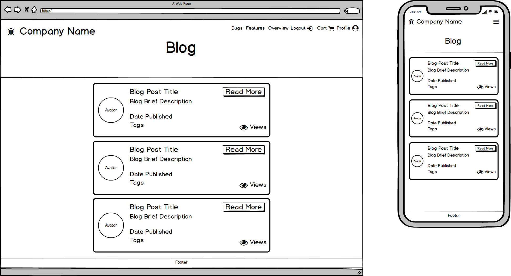

# [Full Stack Frameworks Issue Tracker Application](#)

## UX

## Wireframes created using Balsamiq:

### Homepage

### Login

### Register

### Stats

### Features

### Bugs

### Cart

### Checkout

### Blog - For users with an account only

