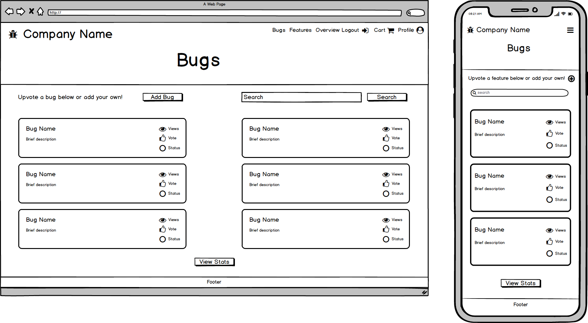

# [Full Stack Frameworks Issue Tracker Application](https://fullstack-issue-tracker.herokuapp.com/)

I have created this issue tracker for the fictional software company Unicorne for the Full Stack Frameworks module of the Code Institute Full Stack Web Development diploma.
This application is built using Django, with a Postgres database. Unicorne Support Center allows users to create feature requests, report bugs and
view the status of the tickets they create. Users are kept up to date with progress with a comments section on each bug/feature detail page.
Bugs and features can be upvoted by users, and the features with the most number of votes will be implemented.
While bugs are free to upvote, the company asks for a donation of £5 per upvote. In return, the company promises to spend 50% of their developer time
working on new exciting features.

## UX

I gathered UX ideas from looking at Github, and issue tracker designs on [Dribbble](https://dribbble.com/search?q=issue+tracker).
I used a color scheme generator to come up with a [palette](https://coolors.co/e8c547-30323d-4d5061-5c80bc-cdd1c4) to use on this site

## User Stories

- A user wants to view the current list of bugs:
    - User can navigate to the list of bugs from the homepage, by clicking on a view more button inside the 'Top Bugs' section

- A user wants to view the current list of features:
    - Same as above, but the user clicks on the view more button inside the 'Top Features' section instead 

- A user wants to submit a feature request:
    - Feature requests are paid-for items on this site. Users are required to pay a fee to submit a feature, and to upvote their own or someone elses feature. 
    - The user is required to log in to be able to access this feature of the site.
    - The user should log in or register via the links in the navigation bar.
    - Once logged in, the user can navigate to the feature request page in the navigation bar.
    - The user should fill out the required fields to submit a feature, and click to submit a feature request, this will add the item to their cart.
    - The users cart will have a number appear next to it in the navbar to indicate an item is in their cart. 
    - The user needs to proceed through the cart and checkout areas in order for their request to be submitted successfully.
    - Once the item is paid for (using Stripe test account) the feature request will appear on the features page and can be upvoted by other users.

- A user wants to submit a bug report:
    - Bug reports are free to submit.
    - The user is still required to log in to access this feature of the site.
    - The user should log in or register via the links in the navigation bar.
    - Once logged in, the user can navigate to the bug report page in the navigation bar.
    - The user should fill out the required fields to submit a bug report, and click the button to submit the report. The item is added to their cart, however there is no fee for this type of request.
    - The users cart will have a number appear next to it in the navbar to indicate an item is in their cart. 
    - The user needs to proceed through the cart and checkout areas in order for their request to be submitted successfully.
    - Once the checkout process is complete, the bug report will appear on the bug page and can be upvoted by other users.

- A user wants to view statistics on how many bugs/features there are, and progress etc:
    - There is a statistics page that can be viewed by any user that is or is not logged in.
    - The user will be able to navigate to this via a button on the homepage under the 'Our Promise' section.
    - The statistics page will feature charts that show the comparison between the number of bugs and features submitted, and the progress of tickets being worked on.

## Wireframes created using Balsamiq:

### Homepage

### Login

### Register

### User Profile

### Stats

### Feature Request

### Features

### Feature Detail

### Bug Report

### Bugs

### Bug Detail

### Ticket Overview

### Cart

### Checkout

## Features

### Existing Features
### Features to implement

## Technologies Used

- [Django](https://www.djangoproject.com/)
    - The project uses **Django**, a python framework to provide the core functionality, templating and authentication on the site

- [HTML5](https://developer.mozilla.org/en-US/docs/Web/Guide/HTML/HTML5)
    - HTML used for the **structure** of the page templates

- [CSS3](https://developer.mozilla.org/en-US/docs/Web/CSS)
    - Language used to apply styles to each page for **styling of the components** (e.g. colour schemes, fonts, images)
    
- [Javascript](https://developer.mozilla.org/en-US/docs/Web/JavaScript)
    - Javascript has been used to implement the Stripe payment functionality, as well as initialising the charts on the statistics page

- [Bootstrap](https://getbootstrap.com/docs/3.3/)
    - I have used Bootstrap throughout the app to implement a responsive UI including navbars, inputs and buttons
    - Bootstrap forms have been used for login, register, payment and bug/feature request forms.

- [PostgreSQL](https://www.postgresql.org/)
    - The production build of this app uses the built in Heroku Postgres database, while the local copy uses [SQLite](https://www.sqlite.org/index.html) 

- [Stripe](https://stripe.com/gb)
    - Stripe is used to process payments from the checkout area.

- [ApexCharts](https://apexcharts.com/)
    - I chose to use ApexCharts to build the statistics dashboard as this library provides a great, eyecatching UX experience and is simple to implement.
    - I converted all the data I needed for the graphs into JSON format first, and had this display on a URL. I then made [ajax](https://www.w3schools.com/js/js_ajax_intro.asp) requests
    - to grab this data from the API's and display them in pie and bar chart form.

## Testing

### Coverage

### Manual Testing

## Bugs

## Deployment

#### Run app locally
#### Environment variables
#### Database set up
#### Deploying to Heroku
#### Contributing

## Credits

### Content
### Media
### Acknowledgements