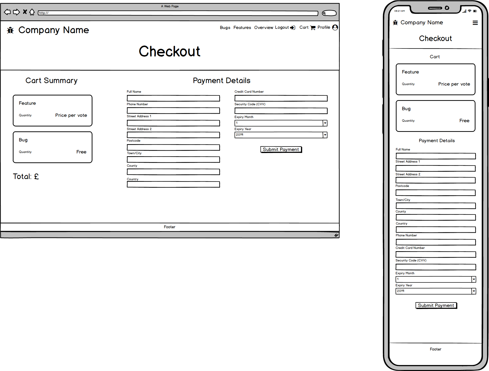

# [Full Stack Frameworks Issue Tracker Application](#)

## UX

## User Stories

- A user wants to view the current list of bugs:
    - User can navigate to the list of bugs from the homepage, by clicking on a view more button inside the 'Top Bugs' section

- A user wants to view the current list of features:
    - Same as above, but the user clicks on the view more button inside the 'Top Features' section instead 

- A user wants to submit a feature request:
    - Feature requests are paid-for items on this site. Users are required to pay a fee to submit a feature, and to upvote their own or someone elses feature. 
    - The user is required to log in to be able to access this feature of the site.
    - The user should log in or register via the links in the navigation bar.
    - Once logged in, the user can navigate to the feature request page in the navigation bar.
    - The user should fill out the required fields to submit a feature, and click to submit a feature request, this will add the item to their cart.
    - The users cart will have a number appear next to it in the navbar to indicate an item is in their cart. 
    - The user needs to proceed through the cart and checkout areas in order for their request to be submitted successfully.
    - Once the item is paid for (using Stripe test account) the feature request will appear on the features page and can be upvoted by other users.

- A user wants to submit a bug report:
    - Bug reports are free to submit.
    - The user is still required to log in to access this feature of the site.
    - The user should log in or register via the links in the navigation bar.
    - Once logged in, the user can navigate to the bug report page in the navigation bar.
    - The user should fill out the required fields to submit a bug report, and click the button to submit the report. The item is added to their cart, however there is no fee for this type of request.
    - The users cart will have a number appear next to it in the navbar to indicate an item is in their cart. 
    - The user needs to proceed through the cart and checkout areas in order for their request to be submitted successfully.
    - Once the checkout process is complete, the bug report will appear on the bug page and can be upvoted by other users.

- A user wants to view statistics on how many bugs/features there are, and progress etc:
    - There is a statistics page that can be viewed by any user that is or is not logged in.
    - The user will be able to navigate to this via a button on the homepage under the 'Our Promise' section.
    - The statistics page will feature charts that show the comparison between the number of bugs and features submitted, and the progress of tickets being worked on.

## Wireframes created using Balsamiq:

### Homepage

### Login

### Register

### User Profile

### Stats

### Feature Request

### Features

### Feature Detail

### Bug Report

### Bugs

### Bug Detail

### Ticket Overview

### Cart

### Checkout

### Blog - For users with an account only

