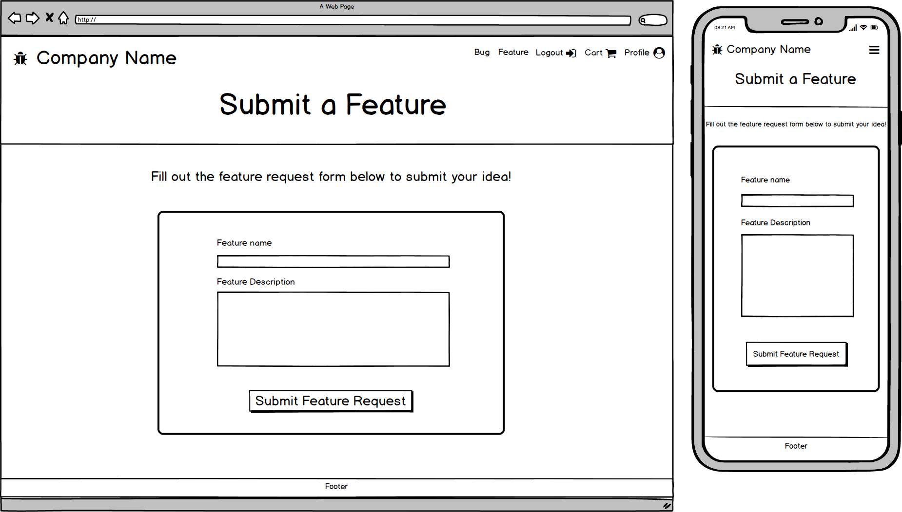
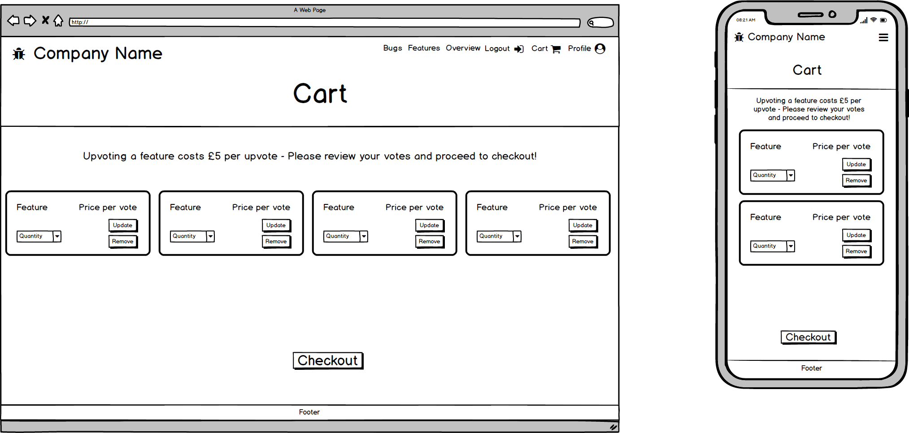

# [Full Stack Frameworks Issue Tracker Application](https://fullstack-issue-tracker.herokuapp.com/)

[](https://travis-ci.org/charlotteskinner90/django_milestone_issue_tracker)

I have created this issue tracker for the fictional software company Unicorne for the Full Stack Frameworks module of the Code Institute Full Stack Web Development diploma.
This application is built using Django, with a Postgres database (on production). **Unicorne Support Center** allows users to create feature requests, report bugs and
view the status of the tickets they create. Users are kept up to date with progress with a comments section on each bug/feature detail page.
Bugs and features can be upvoted by users, and the features with the most number of votes will be implemented by the developers at Unicorne.
While bugs are free to upvote, the company asks for a donation of £5 per feature upvote. In return, the company promises to spend 50% of their developer time
working on new exciting features.

## UX

I gathered UX ideas from looking at Github, and issue tracker designs on [Dribbble](https://dribbble.com/search?q=issue+tracker).
I decided to stick with a simple colour palette, as most SaaS companies use just two or three colours in their schemes. I used a color scheme generator to come up with a 
[palette](https://coolors.co/e8c547-30323d-4d5061-5c80bc-cdd1c4) to use on this site. Each of the areas are easily accessible from the navbar, with nested areas clearly signposted with call-to-action buttons.
The site uses responsive design, with a grid system for the cards on the bugs and feature pages. The responsive design ensures the user can have an optimal experience which ever device they choose to use.

## User Stories

- A user wants to view the current list of bugs:
    - User can navigate to the list of bugs from the homepage, by clicking on the 'All Bugs' button inside the 'Top Bugs' section or from the navigation bar.
    - Users can use the search bar to search for keywords that occur in the name or description of the bugs. The user can press search to search, or reset to go back to the full lister view.

- A user wants to view the current list of features:
    - Same as above, but the user clicks on the 'All Features' button inside the 'Top Features' section instead or accessible from the navigation bar.
    - Users can use the search bar to search for keywords that occur in the name or description of the features. The user can press search to search, or reset to go back to the full lister view.

- A user would like to see more information about a bug/feature:
    - Provided the user is logged in, they will be able to click on one of the bug/feature cards on the lister pages to view a detail page.
    - From here the user can upvote a bug or feature, see the number of views and the status of the request.

- A user wants to submit a feature request:
    - Feature requests are free to post. Users are required to pay a fee to upvote their own or someone elses feature. 
    - The user is required to log in to be able to access this feature of the site.
    - The user should log in or register via the links in the navigation bar.
    - Once logged in, the user can navigate to the feature request page in the from the Features page.
    - The user should fill out the required fields to submit a feature, and click to submit a feature request.
    - The feature request will appear on the features page and can be upvoted by other users.

- A user wants to submit a bug report:
    - Bug reports are free to submit.
    - The user is still required to log in to access this feature of the site.
    - The user should log in or register via the links in the navigation bar.
    - Once logged in, the user can navigate to the bug report page via the bug lister.
    - The user should fill out the required fields to submit a bug report, and click the button to submit the report. 
    - The bug report will appear on the bug page and can be upvoted by other users.

- A user wants to upvote a feature request:
    - The user should view the detail page of the feature they would like to upvote.
    - They can then choose the quantity of votes they would like to apply to this particular feature, and click 'Add to Cart'
    - The users cart will have a number appear next to it in the navbar to indicate an item is in their cart. 
    - The user needs to proceed through the cart and checkout areas in order for their request to be submitted successfully.
    - Once the item is paid for (using Stripe test account) the votes will be added to the feature request.

- A user wants to upvote a bug report:
    - The user should view the bug detail page of the bug they wish to upvote.
    - For bugs, the user can click on the thumb to upvote. Users can only cast one vote per username.

- A user wants to view statistics on how many bugs/features there are, and progress etc:
    - There is a statistics page that can be accessed by logged in users via the navigation bar.
    - The statistics page features charts that show the spread of bugs and features and the progress of the tickets being worked on.
    - Users can also see the top bugs and features upvoted at the time.
    - Users can view the overview page to see an overall view of all the bugs/features tickets and information. Users can search for keywords in the name and description of the tickets to filter the table.

## Wireframes created using Balsamiq:

### Homepage


### Login


### Register


### User Profile


### Stats


### Feature Request



### Features


### Feature Detail


### Bug Report


### Bugs


### Bug Detail


### Ticket Overview


### Cart



### Checkout


## Features

### Existing Features

- The site uses Django user authentication to create a user account and allow the user to log in
- Users can be managed through the admin panel (comes in-built with Django) - go to /admin
- Users can add a bug or feature request by filling out the fields in the request forms. The data from this form is then used to construct the bug/feature detail cards.
- Users can upvote bugs and features. There is a small donation required to upvote features, however the users can vote as many times as they want.
- Users can navigate through the cart and checkout process to process their feature upvotes using Stripe integration.
- Users can view statistics and a general overview of the status of tickets on the Overview (/overview) and Statistics (/stats) pages. 
- The stats page features interactive charts that have been compiled using the JS ApexCharts library.

### Features to implement

- I would like to have made a custom user profile page if I had more time. Upon logging in, the user can fill out a profile area with details including 
- their address, phone number etc. This data will then be used to prefill the personal details required on the checkout page. This would improve the UX as the user would not have to re-enter their details with each purchase.

## Technologies Used

- [Django](https://www.djangoproject.com/)
    - The project uses **Django**, a python framework to provide the core functionality, templating and authentication on the site

- [HTML5](https://developer.mozilla.org/en-US/docs/Web/Guide/HTML/HTML5)
    - HTML used for the **structure** of the page templates

- [CSS3](https://developer.mozilla.org/en-US/docs/Web/CSS)
    - Language used to apply styles to each page for **styling of the components** (e.g. colour schemes, fonts, images)
    
- [Javascript](https://developer.mozilla.org/en-US/docs/Web/JavaScript)
    - Javascript has been used to implement the Stripe payment functionality, as well as initialising the charts on the statistics page

- [Bootstrap](https://getbootstrap.com/docs/3.3/)
    - I have used Bootstrap throughout the app to implement a responsive UI including navbars, inputs and buttons
    - Bootstrap forms have been used for login, register, payment and bug/feature request forms.

- [PostgreSQL](https://www.postgresql.org/)
    - The production build of this app uses the built in Heroku Postgres database, while the local copy uses [SQLite](https://www.sqlite.org/index.html) 

- [Stripe](https://stripe.com/gb)
    - Stripe is used to process payments from the checkout area.

- [ApexCharts](https://apexcharts.com/)
    - I chose to use ApexCharts to build the statistics dashboard as this library provides a great, eyecatching UX experience and is simple to implement.
    - I converted all the data I needed for the graphs into JSON format first, and had this display on a URL. I then made [ajax](https://www.w3schools.com/js/js_ajax_intro.asp) requests to grab this data from the API's and display them in pie and bar chart form.

- [Travis CI](https://travis-ci.org/charlotteskinner90/django_milestone_issue_tracker/builds) for continuous integration - used to build and test the app upon deployment. Displays a badge at the top of the README file.

- [Gunicorn](https://gunicorn.org/)
    - Python WSGI server that runs Django web application code. Used in production deployment to Heroku.

## Testing

### Automated Testing

#### Travis CI

I have integrated Travis CI into the build so that the app is tested as it is deployed to production. Any issues with configuration will be picked up here.
The build details can be viewed [here](https://travis-ci.org/charlotteskinner90/django_milestone_issue_tracker/builds) and there is a badge present on this README file.

#### Coverage

I have used [Coverage](https://coverage.readthedocs.io/en/v4.5.x/) to implement unit tests in Django. 
I have taken screenshots of the resulting coverage readings, which can be accessed [here](https://github.com/charlotteskinner90/django_milestone_issue_tracker/tree/master/static/images/coverage)

### Manual Testing

I have carried out manual testing on various different browsers including Mozilla Firefox, Google Chrome, Edge, Internet Explorer and Opera. I have also carried out testing on various different screen sizes and devices, to get a feel for how responsive the site was.
I have also carried out manual testing for the user stories as follows:

- User not logged in:
    - Only 'Register' and 'Login' options available from the login page
    - Bug lister, Feature lister and Overview can be accessed from the homepage but bug/feature detail pages cannot be accessed by clicking card.
    - User can search bugs/features/overview for keywords in name or description.

- User logged in:
    - Register, Login options no longer available, replaced with Logout.
    - Bugs, Features, Overview, Stats, and Cart tabs also available in the navigation.
    - User can click on the Bug/Feature cards to view the bug/feature detail pages.
    - User can create a bug or feature by filling out the request forms.
    - User can upvote a bug or a feature.
    - Upon upvoting a feature, the user is taken through the ecommerce journey of the cart and checkout with Stripe
    - User can comment on a bug or feature
    - User can view the statistics page with live updating graphs.

## Bugs

- Currently a UX annoyance for the user is to have to enter their personal details i.e. address whenever they go through the checkout process. I will aim to fix this at some point by
creating a custom user model which incorporates a user profile that once completed, will prefill the personal details form upon checkout. I had run out of time to complete this before project submission.

## Deployment

#### Run app locally
- Clone this repository using ``` $ git clone git@github.com:charlotteskinner90/django_milestone_issue_tracker.git ```
- Set up a virtual environment on your machine using the following command in your terminal ``` wget -q https://git.io/v77xs -O /tmp/setup-workspace.sh && source /tmp/setup-workspace.sh ```
- Install dependencies required for the app to run from the requirements.txt file by running the following command in the terminal ```pip install -r requirements.txt```
- Before pushing anything to a repository, create an env.py file in the root directory of the project and add your SECRET_KEY and other variables in here. 
- Add the env.py file to your .gitignore and test that this will not be included in a commit using ``` git status ```
- To use the SQLite database locally, comment out the ``` os.environ.setdefault('DATABASE_URL', '')``` line in settings.py
- To set up the database, run ```python3 manage.py makemigrations``` followed by ```python3 manage.py migrate```
- Use ```python3 manage.py createsuperuser``` to create an admin user for the Django admin panel
- Start adding apps to the application using ```python3 manage.py startapp <name_of_app>``` e.g. accounts or bugs
- Run ```python3 manage.py collectstatic``` in the terminal, this gathers all of the static files into one place to be used on the production server.
- For Cloud9, you can then run the app using the command ```python3 manage.py runserver $IP:$C9_PORT```

#### Environment variables

I had to set up some environment variables inside Heroku in order for the app to appear on the live URL. The following are configured under Settings -> Reveal Config Vars

- AWS_ACCESS_KEY_ID: Available when you set up an S3 bucket with AWS. This is where the static files are hosted.
- AWS_SECRET_ACCESS_KEY: Available when you set up an S3 bucket with AWS. This is where the static files are hosted.
- DATABASE_URL: Should appear in the Config Vars on Heroku when you integrate the Heroku Postgres database add-on.
- DISABLE_COLLECTSTATIC = 1
- SECRET_KEY: Automatically generated when you create a new Django app, I moved this from the settings.py file to the environment variables for security.
- STRIPE_PUBLISHABLE: API key for Stripe integration, can be found inside the Stripe dashboard.
- STRIPE_SECRET: API secret key for Stripe integration, can be found inside the Stripe dashboard. Very important that this is kept safe and never directly committed to a repository.

#### Database set up
- This project uses an SQLite database for development, and PostgreSQL for production. I have used the Heroku Postgres database integration, and incorporated the DATABASE_URL in the environment variables.
- You would need to set up your own PostgreSQL database on Heroku, and then place this DATABASE_URL variable inside your own env.py file.

#### Deploying to Heroku
- If you would like to deploy your own version to Heroku, first make sure that you have a Heroku account.
- Log in to your Heroku account on the CLI ``` $ heroku login ```
- Clone the repository ``` $ heroku git:clone -a fullstack-issue-tracker ``` then ``` $ cd fullstack-issue-tracker ```
- Make your changes
- Set the aforementioned environment variables in the Config Vars section of Heroku (under Settings) before deployment
- Deploy to Heroku using git:
    - ``` $ git add . ```
    - ``` $ git commit -m "commit message" ```
    - ``` $ git push heroku master ```
- Alternatively you can clone the branch from github ``` git clone git@github.com:charlotteskinner90/django_milestone_issue_tracker.git ```
- You can then set up automatic deployments to Heroku from within the Heroku dashboard.

#### Contributing

- Make the desired changes to the app
- If you feel the changes you have made to this app will benefit this project, please feel free to submit a pull request for consideration - thanks!

## Credits

### Content

- In some areas of the design (i.e., use of cards) I took inspiration from various issue trackers on Dribbble(https://dribbble.com/search?q=issue+tracker)
- I used [this](https://howchoo.com/g/yzzkodmzzmj/combine-two-querysets-with-different-models) article as a reference point to work out how to combine two datasets for the overview page.
- I referenced the [Django Docs](https://docs.djangoproject.com/en/2.2/topics/testing/advanced/) on how to create a temporary user. This was useful in the unit testing with Coverage, in areas that required user login.

### Acknowledgements

- I would like to thank my tutor Anthony Ngene for his advice, suggestions and moral support during this final project of my course. 